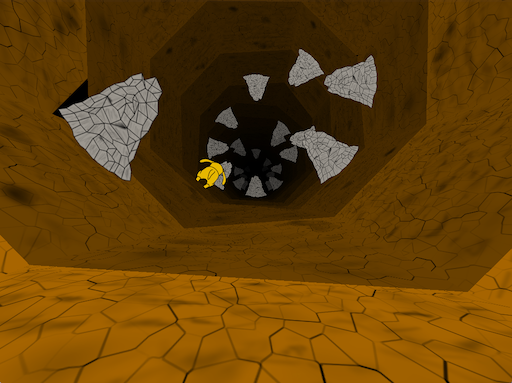

This is the source code of the MolyJam Deux 2013 game [Go Deep](http://www.molyjam.com/games/139)!

### Description

Your dog took the phrase "Go Deep!" too far. Do you have what it
takes to dodge the obstacles to catch up to your dog before he is
lost forever?

Insired by the Peter Molyneux quotation:

	If you love your dog, we're gonna mess with your
	mind, man. You're not going to be able to go to bed.

### Controls

* **SPACE,ESCAPE**: Start, Skip cinematic
* **LEFT,RIGHT**: Navigate tunnel
* **ESCAPE**: Give up

### Screenshots

### Credits

* Programming: Michael Hutchinson
* Music: Patrick Rawlings
* Art: Chester Kwan

### License

#### Code

Copyright (c) 2013 Michael Hutchinson.
[MIT/X11](http://opensource.org/licenses/MIT)

#### Music

Copyright (c) 2013 Patrick Rawlings.
[CC-BY-DC-ND](http://creativecommons.org/licenses/by-nc-nd/3.0/)

#### Art

Copyright (c) 2013 Chester Kwan
[CC-BY-SA]
http://creativecommons.org/licenses/by-sa/2.0/

